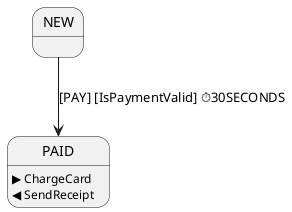

# FSM
This small library contains several implementations for common use cases.
- `ru.girchev.fsm.impl.extended.ExFsm` - a simple fsm that has a status, and it changes the status by events. Has state.
- `ru.girchev.fsm.impl.extended.ExDomainFsm` - if you have some domain with a status, and you want to change this status using events. Has no own state.

You can also use the `ru.girchev.fsm.impl` package with basic implementations.

## How to use examples
### We have these initial data:
```
data class Document(
    val id: String = UUID.randomUUID().toString(),
    override var state: DocumentState = DocumentState.NEW,
    val signRequired: Boolean = false
) : StateContext<DocumentState>

enum class DocumentState {
    NEW, READY_FOR_SIGN, SIGNED, AUTO_SENT, DONE, CANCELED
}
```
### Example of very simple use `ru.girchev.fsm.impl.extended.ExFsm`
```
fun main() {
    val fsm = FsmFactory.statesWithEvents<String, String>()
        .add(from = "NEW", to = "READY_FOR_SIGN", onEvent = "TO_READY")
        .add(from = "READY_FOR_SIGN", to = "SIGNED", onEvent = "USER_SIGN")
        .add(from = "READY_FOR_SIGN", to = "CANCELED", onEvent = "FAILED_EVENT")
        .add(from = "SIGNED", to = "AUTO_SENT")
        .add(from = "AUTO_SENT", to = "DONE", onEvent = "SUCCESS_EVENT")
        .add(from = "AUTO_SENT", to = "CANCELED", onEvent = "FAILED_EVENT")
        .build()
        .createFsm("NEW")
    println("Initial state: ${fsm.getState()}")
    try {
        fsm.onEvent("FAILED_EVENT")
    } catch (ex: Exception) {
        println("$ex")
    }
    println("State still the same: ${fsm.getState()}")
    fsm.onEvent("TO_READY")
    fsm.onEvent("USER_SIGN")
    fsm.onEvent("SUCCESS_EVENT")
    println("Terminal state is DONE = ${fsm.getState()}")
}
```
There are two transitions from the status `READY_FOR_SIGN`:
- `SIGNED` if event `USER_SIGN` will be thrown.
- `CANCELED` if event `FAILED_EVENT` will be thrown.
And two transitions from the status `AUTO_SENT`:
- `DONE` if event `SUCCESS_EVENT` will be thrown.
- `CANCELED` if event `FAILED_EVENT` will be thrown.


### Example for `ru.girchev.fsm.impl.extended.ExDomainFsm`.

```
fun main() {
    val document = Document(signRequired = true)
    val fsm = FsmFactory
        .statesWithEvents<DocumentState, String>()
        .add(from = NEW, onEvent = "TO_READY", to = READY_FOR_SIGN)
        .add(from = READY_FOR_SIGN, onEvent = "USER_SIGN", to = SIGNED)
        .add(from = READY_FOR_SIGN, onEvent = "FAILED_EVENT", to = CANCELED)
        .add(from = SIGNED, onEvent = "FAILED_EVENT", to = CANCELED)
        .add(
            from = SIGNED, onEvent = "TO_END",                                        // switch case example
            To(AUTO_SENT, condition = { document.signRequired }),                   // first
            To(DONE, condition = { !document.signRequired }),                       // second
            To(CANCELED)                                                            // else
        )
        .add(from = AUTO_SENT, onEvent = "TO_END", to = DONE)
        .build()
        .createDomainFsm<Document>()
    try {
        fsm.handle(document, "FAILED_EVENT")
    } catch (ex: Exception) {
        println("$ex")
    }
    println("State still the same - NEW = ${document.state}")
    fsm.handle(document, "TO_READY")
    println("READY_FOR_SIGN = ${document.state}")

    fsm.handle(document, "USER_SIGN")
    println("SIGNED = ${document.state}")

    fsm.handle(document, "TO_END")
    println("AUTO_SENT = ${document.state}")

    fsm.handle(document, "TO_END")
    println("Terminal state is DONE = ${document.state}")
}
```

There are we add new extra steps. From `SIGNED` we have 3 different transitions for only one event `TO_END`:
- `AUTO_SENT` if condition `document.signRequired` will be `true`.
- `DONE` if condition `!document.signRequired` will be `true`.
- `CANCELED` if both previous conditions were `false` (definitely this case impossible, but you can change conditions for `false` in both cases).

### Example with fluent builder

We rewrite code with the same transitions
```
fun main() {
    val document = Document(signRequired = true)
    val fsm = FsmFactory.statesWithEvents<DocumentState, String>()
            .from(NEW).to(READY_FOR_SIGN).onEvent("TO_READY").end()

            .from(READY_FOR_SIGN).toMultiple()
            .to(SIGNED).onEvent("USER_SIGN").end()
            .to(CANCELED).onEvent("FAILED_EVENT").end()
            .endMultiple()

            .from(SIGNED).onEvent("TO_END").toMultiple()
            .to(AUTO_SENT).condition { document.signRequired }.end()
            .to(DONE).condition { !document.signRequired }.end()
            .to(CANCELED).end()
            .endMultiple()

            .from(AUTO_SENT).onEvent("TO_END").to(DONE).end()
            .build().createDomainFsm<Document>()
    try {
        fsm.handle(document, "FAILED_EVENT")
    } catch (ex: Exception) {
        println("$ex")
    }
    println("State still the same - NEW = ${document.state}")
    fsm.handle(document, "TO_READY")
    println("READY_FOR_SIGN = ${document.state}")

    fsm.handle(document, "USER_SIGN")
    println("SIGNED = ${document.state}")

    fsm.handle(document, "TO_END")
    println("AUTO_SENT = ${document.state}")

    fsm.handle(document, "TO_END")
    println("Terminal state is DONE = ${document.state}")
}
```

### Example with timers - traffic light.
```
fun main() {
    val fsm = ExFsm("INITIAL", ExTransitionTable.Builder<String, String>()
        .add(ExTransition(from = "INITIAL", to = "GREEN", onEvent = "RUN"))
        .add(ExTransition(from = "RED", to = To("GREEN", timeout = Timeout(3), action = { println(it) })))
        .add(ExTransition(from = "GREEN", to = To("YELLOW", timeout = Timeout(3), action = { println(it) })))
        .add(ExTransition(from = "YELLOW", to = To("RED", timeout = Timeout(3), action = { println(it) })))
        .build())

    fsm.onEvent("RUN")
}
```
OR
```
fun main() {
    val fsm = FsmFactory.statesWithEvents<String, String>()
            .from("INITIAL").to("GREEN").onEvent("RUN").end()
            .from("RED").to("GREEN").timeout(Timeout(3)).action { println(it) }.end()
            .from("GREEN").to("YELLOW").timeout(Timeout(3)).action { println(it) }.end()
            .from("YELLOW").to("RED").timeout(Timeout(3)).action { println(it) }.end()
            .build().createFsm("INITIAL")

    fsm.onEvent("RUN")
}
```

## FSM Diagram Visualization

The library supports diagram generation in **PlantUML** and **Mermaid** formats for visualizing finite state machines.

### Quick Start

```kotlin
import ru.girchev.fsm.diagram.*

// Create FSM
val transitionTable = ExTransitionTable.Builder<DocumentState, String>()
    .from(NEW).to(READY_FOR_SIGN).onEvent("TO_READY").end()
    .from(READY_FOR_SIGN).to(SIGNED).onEvent("USER_SIGN").timeout(Timeout(1)).end()
    .from(SIGNED).to(DONE).onEvent("TO_END").end()
    .build()

// Generate diagrams
println(transitionTable.toPlantUml())
println(transitionTable.toMermaid())
```

### Named Actions and Conditions

For more readable diagrams, use `NamedAction` and `NamedGuard`:

```kotlin
// Define named actions and conditions
val chargeCard = NamedAction<Any>("ChargeCard") { /* ... */ }
val sendReceipt = NamedAction<Any>("SendReceipt") { /* ... */ }
val isPaymentValid = NamedGuard<Any>("IsPaymentValid") { true }

// Build FSM
val fsm = ExTransitionTable.Builder<OrderState, String>()
    .from(NEW)
    .onEvent("PAY")
    .to(PAID)
    .condition(isPaymentValid)    // Displayed on arrow: [IsPaymentValid]
    .action(chargeCard)           // Displayed in PAID state: ▶ ChargeCard
    .postAction(sendReceipt)      // Displayed in PAID state: ◀ SendReceipt
    .timeout(Timeout(30))
    .end()
    .build()
```

### Output Example

**PlantUML:**


**Mermaid:**
```mermaid
stateDiagram-v2

    state PAID {
        PAID : ▶ ChargeCard
        PAID : ◀ SendReceipt
    }

    NEW --> PAID : PAY [IsPaymentValid] ⏱30s
```

### Notation

**Inside states:**
- `▶ ActionName` - action executed when entering the state
- `◀ PostActionName` - action executed after entering the state

**On transition arrows:**
- `[EVENT]` - transition event
- `[ConditionName]` - transition condition
- `⏱30s` - timeout

### Diagram Visualization

- **PlantUML**: [Online Editor](http://www.plantuml.com/plantuml/uml/) | [IntelliJ Plugin](https://plugins.jetbrains.com/plugin/7017-plantuml-integration)
- **Mermaid**: [Live Editor](https://mermaid.live/) | [IntelliJ Plugin](https://plugins.jetbrains.com/plugin/20146-mermaid) | GitHub automatically renders Mermaid in markdown

### Extension Functions

```kotlin
// Print to console
transitionTable.printPlantUml()
transitionTable.printMermaid()

// Get string
val plantUml: String = transitionTable.toPlantUml()
val mermaid: String = transitionTable.toMermaid()

// Save to file
transitionTable.toPlantUml(Path("diagram.plantuml"))
transitionTable.toMermaid(Path("diagram.mermaid"))
```