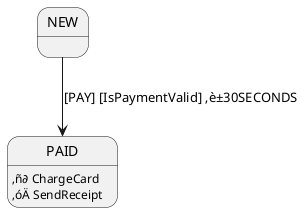

# FSM

[](https://github.com/NGirchev/fsm/actions/workflows/ci.yml)
[](https://search.maven.org/artifact/io.github.ngirchev/fsm)
[](https://opensource.org/licenses/MIT)
[](https://kotlinlang.org/)
[](https://gradle.org/)
[](https://adoptium.net/)
[](https://sonarcloud.io/summary/new_code?id=NGirchev_fsm)
[](https://sonarcloud.io/summary/new_code?id=NGirchev_fsm)
[](https://sonarcloud.io/summary/new_code?id=NGirchev_fsm)
[](https://sonarcloud.io/summary/new_code?id=NGirchev_fsm)
[](https://sonarcloud.io/summary/new_code?id=NGirchev_fsm)
[](https://sonarcloud.io/summary/new_code?id=NGirchev_fsm)
[](https://sonarcloud.io/summary/new_code?id=NGirchev_fsm)
[](https://sonarcloud.io/summary/new_code?id=NGirchev_fsm)
[](https://sonarcloud.io/summary/new_code?id=NGirchev_fsm)

Finite state machine utilities library for Kotlin.

This small library contains several implementations for common use cases.
- `io.github.ngirchev.fsm.impl.extended.ExFsm` - a simple fsm that has a status, and it changes the status by events. Has state.
- `io.github.ngirchev.fsm.impl.extended.ExDomainFsm` - if you have some domain with a status, and you want to change this status using events. Has no own state.

You can also use the `io.github.ngirchev.fsm.impl` package with basic implementations.

## Installation

### Gradle (Kotlin DSL)

```kotlin
dependencies {
    implementation("io.github.ngirchev:fsm:1.0.0")
}
```

### Gradle (Groovy DSL)

```groovy
dependencies {
    implementation 'io.github.ngirchev:fsm:1.0.0'
}
```

### Maven

```xml
<dependency>
    <groupId>io.github.ngirchev</groupId>
    <artifactId>fsm</artifactId>
    <version>1.0.0</version>
</dependency>
```

## Usage Examples
### We have these initial data:
```
data class Document(
    val id: String = UUID.randomUUID().toString(),
    override var state: DocumentState = DocumentState.NEW,
    val signRequired: Boolean = false
) : StateContext<DocumentState>

enum class DocumentState {
    NEW, READY_FOR_SIGN, SIGNED, AUTO_SENT, DONE, CANCELED
}
```
### Example of very simple use `io.github.ngirchev.fsm.impl.extended.ExFsm`
```
fun main() {
    val fsm = FsmFactory.statesWithEvents<String, String>()
        .add(from = "NEW", to = "READY_FOR_SIGN", onEvent = "TO_READY")
        .add(from = "READY_FOR_SIGN", to = "SIGNED", onEvent = "USER_SIGN")
        .add(from = "READY_FOR_SIGN", to = "CANCELED", onEvent = "FAILED_EVENT")
        .add(from = "SIGNED", to = "AUTO_SENT")
        .add(from = "AUTO_SENT", to = "DONE", onEvent = "SUCCESS_EVENT")
        .add(from = "AUTO_SENT", to = "CANCELED", onEvent = "FAILED_EVENT")
        .build()
        .createFsm("NEW")
    println("Initial state: ${fsm.getState()}")
    try {
        fsm.onEvent("FAILED_EVENT")
    } catch (ex: Exception) {
        println("$ex")
    }
    println("State still the same: ${fsm.getState()}")
    fsm.onEvent("TO_READY")
    fsm.onEvent("USER_SIGN")
    fsm.onEvent("SUCCESS_EVENT")
    println("Terminal state is DONE = ${fsm.getState()}")
}
```
There are two transitions from the status `READY_FOR_SIGN`:
- `SIGNED` if event `USER_SIGN` will be thrown.
- `CANCELED` if event `FAILED_EVENT` will be thrown.
And two transitions from the status `AUTO_SENT`:
- `DONE` if event `SUCCESS_EVENT` will be thrown.
- `CANCELED` if event `FAILED_EVENT` will be thrown.


### Example for `io.github.ngirchev.fsm.impl.extended.ExDomainFsm`.

```
fun main() {
    val document = Document(signRequired = true)
    val fsm = FsmFactory
        .statesWithEvents<DocumentState, String>()
        .add(from = NEW, onEvent = "TO_READY", to = READY_FOR_SIGN)
        .add(from = READY_FOR_SIGN, onEvent = "USER_SIGN", to = SIGNED)
        .add(from = READY_FOR_SIGN, onEvent = "FAILED_EVENT", to = CANCELED)
        .add(from = SIGNED, onEvent = "FAILED_EVENT", to = CANCELED)
        .add(
            from = SIGNED, onEvent = "TO_END",                                        // switch case example
            To(AUTO_SENT, condition = { document.signRequired }),                   // first
            To(DONE, condition = { !document.signRequired }),                       // second
            To(CANCELED)                                                            // else
        )
        .add(from = AUTO_SENT, onEvent = "TO_END", to = DONE)
        .build()
        .createDomainFsm<Document>()
    try {
        fsm.handle(document, "FAILED_EVENT")
    } catch (ex: Exception) {
        println("$ex")
    }
    println("State still the same - NEW = ${document.state}")
    fsm.handle(document, "TO_READY")
    println("READY_FOR_SIGN = ${document.state}")

    fsm.handle(document, "USER_SIGN")
    println("SIGNED = ${document.state}")

    fsm.handle(document, "TO_END")
    println("AUTO_SENT = ${document.state}")

    fsm.handle(document, "TO_END")
    println("Terminal state is DONE = ${document.state}")
}
```

There are we add new extra steps. From `SIGNED` we have 3 different transitions for only one event `TO_END`:
- `AUTO_SENT` if condition `document.signRequired` will be `true`.
- `DONE` if condition `!document.signRequired` will be `true`.
- `CANCELED` if both previous conditions were `false` (definitely this case impossible, but you can change conditions for `false` in both cases).

### Example with fluent builder

We rewrite code with the same transitions
```
fun main() {
    val document = Document(signRequired = true)
    val fsm = FsmFactory.statesWithEvents<DocumentState, String>()
            .from(NEW).to(READY_FOR_SIGN).onEvent("TO_READY").end()

            .from(READY_FOR_SIGN).toMultiple()
            .to(SIGNED).onEvent("USER_SIGN").end()
            .to(CANCELED).onEvent("FAILED_EVENT").end()
            .endMultiple()

            .from(SIGNED).onEvent("TO_END").toMultiple()
            .to(AUTO_SENT).condition { document.signRequired }.end()
            .to(DONE).condition { !document.signRequired }.end()
            .to(CANCELED).end()
            .endMultiple()

            .from(AUTO_SENT).onEvent("TO_END").to(DONE).end()
            .build().createDomainFsm<Document>()
    try {
        fsm.handle(document, "FAILED_EVENT")
    } catch (ex: Exception) {
        println("$ex")
    }
    println("State still the same - NEW = ${document.state}")
    fsm.handle(document, "TO_READY")
    println("READY_FOR_SIGN = ${document.state}")

    fsm.handle(document, "USER_SIGN")
    println("SIGNED = ${document.state}")

    fsm.handle(document, "TO_END")
    println("AUTO_SENT = ${document.state}")

    fsm.handle(document, "TO_END")
    println("Terminal state is DONE = ${document.state}")
}
```

### Example with timers - traffic light.
```
fun main() {
    val fsm = ExFsm("INITIAL", ExTransitionTable.Builder<String, String>()
        .add(ExTransition(from = "INITIAL", to = "GREEN", onEvent = "RUN"))
        .add(ExTransition(from = "RED", to = To("GREEN", timeout = Timeout(3), action = { println(it) })))
        .add(ExTransition(from = "GREEN", to = To("YELLOW", timeout = Timeout(3), action = { println(it) })))
        .add(ExTransition(from = "YELLOW", to = To("RED", timeout = Timeout(3), action = { println(it) })))
        .build())

    fsm.onEvent("RUN")
}
```
OR
```
fun main() {
    val fsm = FsmFactory.statesWithEvents<String, String>()
            .from("INITIAL").to("GREEN").onEvent("RUN").end()
            .from("RED").to("GREEN").timeout(Timeout(3)).action { println(it) }.end()
            .from("GREEN").to("YELLOW").timeout(Timeout(3)).action { println(it) }.end()
            .from("YELLOW").to("RED").timeout(Timeout(3)).action { println(it) }.end()
            .build().createFsm("INITIAL")

    fsm.onEvent("RUN")
}
```

## FSM Diagram Visualization

The library supports diagram generation in **PlantUML** and **Mermaid** formats for visualizing finite state machines.

### Quick Start

```kotlin
import io.github.ngirchev.fsm.diagram.*

// Create FSM
val transitionTable = ExTransitionTable.Builder<DocumentState, String>()
    .from(NEW).to(READY_FOR_SIGN).onEvent("TO_READY").end()
    .from(READY_FOR_SIGN).to(SIGNED).onEvent("USER_SIGN").timeout(Timeout(1)).end()
    .from(SIGNED).to(DONE).onEvent("TO_END").end()
    .build()

// Generate diagrams
println(transitionTable.toPlantUml())
println(transitionTable.toMermaid())
```

### Named Actions and Conditions

For more readable diagrams, use `NamedAction` and `NamedGuard`:

```kotlin
// Define named actions and conditions
val chargeCard = NamedAction<Any>("ChargeCard") { /* ... */ }
val sendReceipt = NamedAction<Any>("SendReceipt") { /* ... */ }
val isPaymentValid = NamedGuard<Any>("IsPaymentValid") { true }

// Build FSM
val fsm = ExTransitionTable.Builder<OrderState, String>()
    .from(NEW)
    .onEvent("PAY")
    .to(PAID)
    .condition(isPaymentValid)    // Displayed on arrow: [IsPaymentValid]
    .action(chargeCard)           // Displayed in PAID state: ▶ ChargeCard
    .postAction(sendReceipt)      // Displayed in PAID state: ◀ SendReceipt
    .timeout(Timeout(30))
    .end()
    .build()
```

### Output Example

**PlantUML:**


**Mermaid:**
```mermaid
stateDiagram-v2

    state PAID {
        PAID : ▶ ChargeCard
        PAID : ◀ SendReceipt
    }

    NEW --> PAID : PAY [IsPaymentValid] ⏱30s
```

### Notation

**Inside states:**
- `▶ ActionName` - action executed when entering the state
- `◀ PostActionName` - action executed after entering the state

**On transition arrows:**
- `[EVENT]` - transition event
- `[ConditionName]` - transition condition
- `⏱30s` - timeout

### Diagram Visualization

- **PlantUML**: [Online Editor](http://www.plantuml.com/plantuml/uml/) | [IntelliJ Plugin](https://plugins.jetbrains.com/plugin/7017-plantuml-integration)
- **Mermaid**: [Live Editor](https://mermaid.live/) | [IntelliJ Plugin](https://plugins.jetbrains.com/plugin/20146-mermaid) | GitHub automatically renders Mermaid in markdown

### Extension Functions

```kotlin
// Print to console
transitionTable.printPlantUml()
transitionTable.printMermaid()

// Get string
val plantUml: String = transitionTable.toPlantUml()
val mermaid: String = transitionTable.toMermaid()

// Save to file
transitionTable.toPlantUml(Path("diagram.plantuml"))
transitionTable.toMermaid(Path("diagram.mermaid"))
```

## Features

* 🚀 Simple and lightweight finite state machine implementation
* 📊 Support for state diagrams generation (PlantUML and Mermaid)
* 🔄 Multiple FSM implementations for different use cases
* ⏱️ Support for timeouts and actions
* 🎯 Type-safe state transitions
* 🧪 Fully tested with JUnit 5
* 📝 Logging support via SLF4J

## Requirements

**This project is buildable using only FLOSS (Free/Libre and Open Source Software) tools.**

* **Java 8 or higher** (OpenJDK recommended - FLOSS)
* **Gradle 7.0+** (Gradle - FLOSS)
* **Kotlin 1.6.21+**

All build tools, dependencies, and test frameworks used are FLOSS.

## Versioning

This project uses **Semantic Versioning** (`MAJOR.MINOR.PATCH`, e.g. `1.0.0`).  
Each release has a **unique version identifier**, is tagged in Git as `v{version}` (e.g. `v1.0.0`).  
Development builds use the `-SNAPSHOT` suffix (e.g. `1.0.1-SNAPSHOT`) and are not intended for production use.

## Testing

### Automated Test Suite

**This project uses an automated test suite that is publicly released as FLOSS.**

The project uses **JUnit 5** (JUnit Jupiter) as the test framework, which is:

* Publicly released as FLOSS (licensed under the Eclipse Public License 2.0)
* Maintained as a separate FLOSS project
* Standard testing framework for Java/Kotlin applications

The test suite includes comprehensive unit tests covering:

* FSM state transitions
* Event handling
* Timeout functionality
* Error handling and edge cases
* Diagram generation

### Running Tests

**The test suite is invocable in a standard way for Java/Kotlin projects using Gradle.**

To run the automated test suite:

```bash
./gradlew test
```

This is the **standard Gradle command** for running tests. The command will:

1. Compile the source code
2. Compile the test code
3. Execute all tests using JUnit 5
4. Display test results

**Alternative ways to run tests:**

```bash
# Run tests with verbose output
./gradlew test --info

# Run a specific test class
./gradlew test --tests "io.github.ngirchev.fsm.impl.basic.BFsmTest"

# Run tests and generate coverage report
./gradlew test jacocoTestReport
```

### Code Coverage

**The project uses JaCoCo for code coverage analysis.**

JaCoCo is:

* A FLOSS Java code coverage library
* Integrated into the Gradle build process
* Automatically generates coverage reports during testing
* Enforces minimum coverage thresholds to maintain code quality

**Coverage requirements:**

* Minimum line coverage: 80%
* Minimum branch coverage: 70%

Coverage reports are generated automatically during the build and can be viewed at `build/reports/jacoco/test/html/index.html` after running `./gradlew test jacocoTestReport`.

To check coverage thresholds:

```bash
./gradlew jacocoTestCoverageVerification
```

The build will fail if coverage thresholds are not met.

### Code Quality

The project uses the following tools for code quality:

* **Detekt** - Static code analysis for Kotlin
* **Kotlinter** - Kotlin linter and formatter

To run code quality checks:

```bash
# Run Detekt
./gradlew detekt

# Run Kotlinter
./gradlew lintKotlinMain lintKotlinTest
```

## CI/CD

The project uses GitHub Actions for continuous integration:

1. **CI Pipeline** (`.github/workflows/ci.yml`):  
   * Runs on every push and pull request  
   * Builds the project and runs all tests
   * Executes code quality checks (Detekt, Kotlinter)
   * Generates and verifies code coverage reports
   * Uploads build artifacts and reports

**CI Pipeline URL**: <https://github.com/NGirchev/fsm/actions>

## Releasing

### Prerequisites for Maven Central

Before publishing to Maven Central, you need to:

1. **Create a Sonatype OSSRH account**:
   - Sign up at https://s01.oss.sonatype.org/
   - Create a JIRA ticket to request access for your groupId (`io.github.ngirchev`)
   - Wait for approval (usually 1-2 business days)

2. **Set up GPG signing**:
   - Install GPG (if not already installed)
   - Generate a GPG key: `gpg --gen-key`
   - Export your public key: `gpg --keyserver keyserver.ubuntu.com --send-keys <your-key-id>`
   - Export your private key for use in Gradle (see below)

3. **Configure credentials**:
   
   Gradle will automatically read credentials from Maven `~/.m2/settings.xml` (same as Maven uses):
   
   ```xml
   <settings>
     <servers>
       <server>
         <id>central</id>
         <username>your-sonatype-username</username>
         <password>your-sonatype-password</password>
       </server>
     </servers>
     <profiles>
       <profile>
         <id>release</id>
         <properties>
           <gpg.executable>gpg</gpg.executable>
           <gpg.keyname>your-gpg-key-id</gpg.keyname>
           <gpg.passphrase>your-gpg-passphrase</gpg.passphrase>
         </properties>
       </profile>
     </profiles>
   </settings>
   ```
   
   Alternatively, you can use `~/.gradle/gradle.properties`:
   
   ```properties
   ossrhUsername=your-sonatype-username
   ossrhPassword=your-sonatype-password
   signingKeyId=your-gpg-key-id
   signingPassword=your-gpg-passphrase
   ```
   
   Or use the properties format supported by the `com.vanniktech.maven.publish` plugin:
   
   ```properties
   mavenCentralUsername=your-sonatype-username
   mavenCentralPassword=your-sonatype-password
   signing.gnupg.keyName=your-gpg-key-id
   signing.gnupg.passphrase=your-gpg-passphrase
   signing.gnupg.executable=gpg
   ```

   **Security Note**: Never commit these credentials to the repository. Use `~/.m2/settings.xml` or `~/.gradle/gradle.properties` (both are typically in `.gitignore`).

### Manual Release

To create a release and publish to Maven Central:

```bash
# 1. Update CHANGELOG.md with release notes

# 2. Prepare release (this will update version in gradle.properties and create Git tag)
./gradlew release -Prelease.useAutomaticVersion=true

# 3. Build and test
./gradlew clean build

# 4. Publish to Maven Central staging repository
./gradlew publish

# 5. After successful upload, go to https://s01.oss.sonatype.org/
#    - Login and navigate to "Staging Repositories"
#    - Find your repository (starts with iogithubngirchev)
#    - Close the repository (this validates the artifacts)
#    - Release the repository (this syncs to Maven Central)
#    - Wait 10-30 minutes for sync to Maven Central

# 6. Push changes and tags (release plugin creates the tag automatically)
git push origin master
git push --tags

# 7. Create GitHub release with CHANGELOG notes
```

**Note:**

* The `release` plugin automatically:
  - Updates version in `gradle.properties` (removes -SNAPSHOT)
  - Creates a Git tag with format `v{version}` (e.g., `v1.0.1`)
  - Commits version changes
* After publishing, artifacts will be available at: https://repo1.maven.org/maven2/io/github/ngirchev/fsm/
* Maven Central sync usually takes 10-30 minutes after release

## Contributing

Contributions are welcome! We appreciate your help in making this project better.

### How to Contribute

1. Fork the repository
2. Create a feature branch (`git checkout -b feature/your-feature-name`)
3. Make your changes
4. Run tests (`./gradlew test`)
5. Run code quality checks (`./gradlew detekt lintKotlinMain lintKotlinTest`)
6. Commit your changes (`git commit -am 'Add some feature'`)
7. Push to the branch (`git push origin feature/your-feature-name`)
8. Create a Pull Request

### Contribution Requirements

All contributions must meet our requirements for acceptable contributions, including:

* **Coding Standards**: Follow Kotlin code conventions and maintain consistent style
* **Testing**: Ensure all tests pass and add tests for new features
* **Documentation**: Add KDoc comments for public APIs
* **Code Quality**: Write clean, readable, and maintainable code

For detailed contribution requirements, coding standards, and guidelines, please see [CONTRIBUTING.md](CONTRIBUTING.md).

## Reporting Issues and Suggesting Enhancements

Found a bug or have an idea for improvement? We'd love to hear from you!

**Issue Tracker URL**: <https://github.com/NGirchev/fsm/issues>

### How to Report Bugs

To submit a bug report:

1. Go to the GitHub Issues page
2. Click "New Issue"
3. Select "Bug Report" template (if available) or create a new issue
4. Include the following information:  
   * **Description**: Clear description of the problem  
   * **Steps to Reproduce**: Detailed steps to reproduce the issue  
   * **Expected Behavior**: What you expected to happen  
   * **Actual Behavior**: What actually happened  
   * **Environment**: Java version, OS, library version, etc.  
   * **Code Example**: Minimal code example that demonstrates the issue (if applicable)

**Language**: Please submit bug reports, feature requests, and comments in **English** to ensure they can be understood and addressed by the global developer community.

### Enhancement Requests

To suggest an enhancement or new feature:

1. Go to the GitHub Issues page
2. Click "New Issue"
3. Select "Feature Request" template (if available) or create a new issue with the `enhancement` label
4. Describe the enhancement, its use case, and potential benefits

## License

See [LICENSE](LICENSE) file for details.

## Contributors

* NGirchev - Creator and maintainer